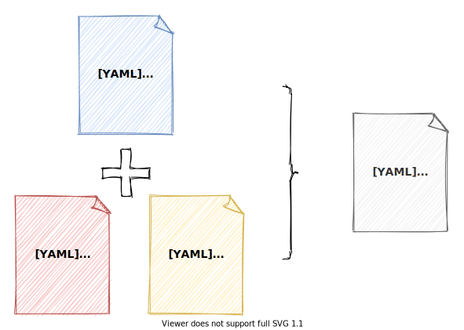

# IstioFilter

---
Manage the istio configuration of the application through patches.



## Installation
```shell
git clone https://github.com/istio-conductor/istiofilter.git
sh istiofilter/demo/install.sh
```
## Quick Glimpse

### Install BookInfo Application
```shell
kubectl apply -f https://raw.githubusercontent.com/istio/istio/release-1.8/samples/bookinfo/platform/kube/bookinfo.yaml
kubectl apply -f https://raw.githubusercontent.com/istio/istio/release-1.8/samples/bookinfo/networking/destination-rule-all.yaml
kubectl apply -f https://raw.githubusercontent.com/istio/istio/release-1.8/samples/bookinfo/networking/virtual-service-all-v1.yaml
```

### Enable `productpage` Mirroring By IstioFilter
```shell
cat <<EOF | kubectl create -f -
apiVersion: configuration.istio-conductor.org/v1alpha1
kind: IstioFilter
metadata:
  name: productpage-mirror
spec:
  schema: VIRTUAL_SERVICE
  selectors:
    - name: productpage
  changes:
    - match:
        simple: DEFAULT
      applyTo: HTTP_ROUTE
      patch:
        operation: MERGE
        value:
          mirror:
            host: productpage
            subset: v2
          mirror_percent: 100
EOF
```

### Check `productpage`'s VirtualService

```shell
kubectl get vs productpage  -o yaml
```

Got output like this:
```yaml
apiVersion: networking.istio.io/v1beta1
kind: VirtualService
metadata:
  name: productpage
  namespace: default
spec:
  hosts:
    - productpage
  http:
    - mirror:
        host: productpage
        subset: v2
      mirrorPercent: 100
      route:
        - destination:
            host: productpage
            subset: v1
```
